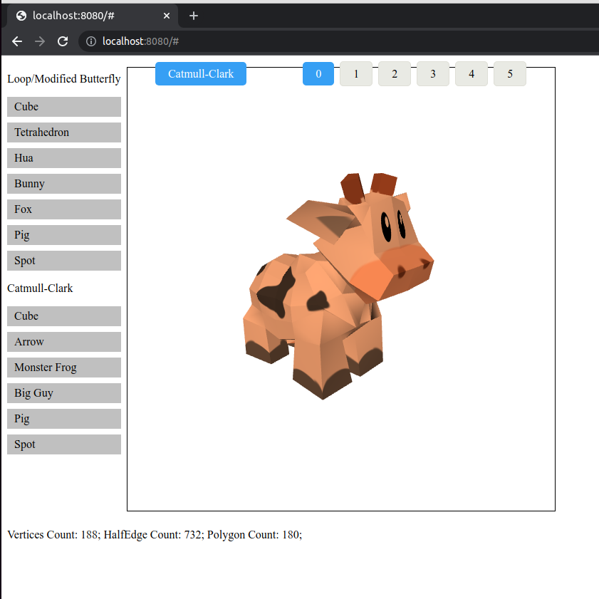
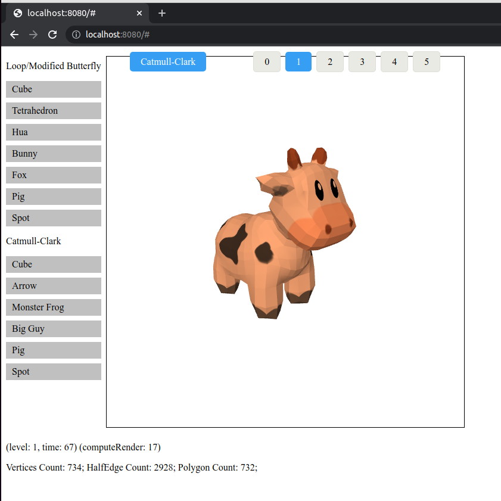

# Simple and Fast Subdivision Reboot
<s>[Demo]().</s>
require WebGL 2.

MIT LICENSE. Any feedback, problem, remark or question about the code, file an issue or contact me at boeing.chen@gmail.com

## Screenshots
 

## Why Subdivision Surfaces
We want smooth surfaces which polygon meshes arent.

NURBS is not the solution because we must stitch togther multiple NURBS patches to model complex geometry, and that cause problems when animating.

Subdivision surfaces(Catmull-Clark, Loop) are generalization of spline curves/surfaces.

Subdivision surface use small amount of data. We want ot optimize for data size since compute improve faster than memory bandwidth for the forseeable future.

## Implementation Goals
Manifold polygon meshes used directly as subdivision surfaces.

Simple to implemented, used and fast.

## Implementation Info
Inspired by [A HalfEdge Refinement Rule for Parallel Catmull-Clark Subdivision](https://onrendering.com/) by Jonathan Dupuy, Kenneth Vanhoey

Editable Polygon Mesh, internal use DirectedEdge representation of Loop subdivision.

[design_note](docs/design_note.md)

[api](docs/api.md)

[reference](docs/referenc.md)

## Roadmap
[Roadmap](docs/roadmap.md)